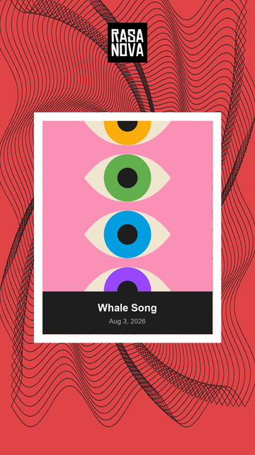
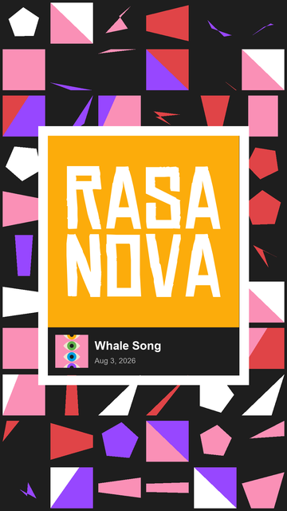
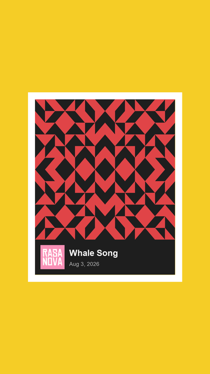
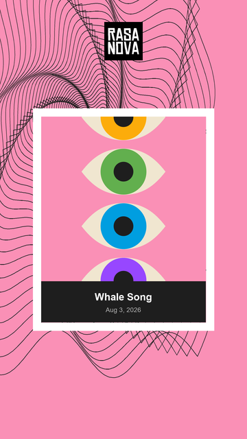
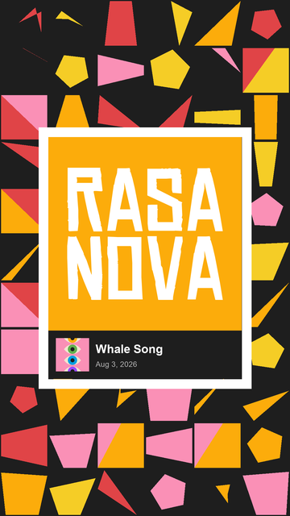
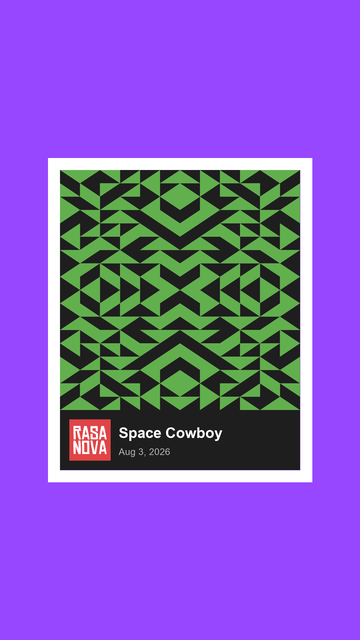

# video-looper

Generates unique brand-palette **YouTube / Instagram Shorts** (1080×1920) for a song.

Three Now Playing layouts: **Style A** (spiral), **Style B** (mosaic), **Style C** (kaleidoscope on solid color).

## Previews

| Style A — spiral + cover | Style B — mosaic + logo | Style C — solid + kaleidoscope |
|:---:|:---:|:---:|
|  |  |  |
|  |  |  |

Top row: *Whale Song*. Bottom row: *Space Cowboy*. Videos zoom/pulse to the music and hard-cut art variants on volume peaks. Audio fades 1s in/out.

## Setup

```bash
cd video-looper
python3 -m venv .venv
.venv/bin/pip install -r requirements.txt
brew install cairo   # required by cairosvg (logo + covers)
```

Needs **FFmpeg** on your PATH (MoviePy uses it).

## Input

Drop songs in `audio/`:

- Formats: `.mp3`, `.wav`, `.aac`, `.m4a`
- Media files are gitignored — keep them local only

Artwork is generated per song (no `video/` source clips).

## Quick start

**Interactive (pick song + layout):**

```bash
.venv/bin/python3 loop_video.py
```

**One song, one style:**

```bash
.venv/bin/python3 scripts/render_song.py "04 - Whale Song.wav" a
.venv/bin/python3 scripts/render_song.py "04 - Whale Song.wav" b
.venv/bin/python3 scripts/render_song.py "04 - Whale Song.wav" c
```

**All three styles for one song:**

```bash
chmod +x scripts/render_both.sh
./scripts/render_both.sh "04 - Whale Song.wav"
```

**Static preview PNGs (3 variants × Style A/B/C):**

```bash
.venv/bin/python3 scripts/make_previews.py "04 - Whale Song.wav"
# → output/preview/<Song>_STYLE_A_bg1_….png … STYLE_C_v3_….png
# Style A/B variants each use a distinct cover template for review diversity.
```

**Batch every file in `audio/`:**

```bash
.venv/bin/python3 video_bus.py a
.venv/bin/python3 video_bus.py b
.venv/bin/python3 video_bus.py c
```

## Example scripts

| Script | What it does |
|--------|----------------|
| [`scripts/render_song.py`](scripts/render_song.py) | Render one MP4: `song` + `a\|b\|c` |
| [`scripts/render_both.sh`](scripts/render_both.sh) | Render Style A, B, then C for one song |
| [`scripts/make_previews.py`](scripts/make_previews.py) | Write 9 static review PNGs (A×3, B×3, C×3; distinct covers on A/B) |
| [`loop_video.py`](loop_video.py) | Interactive song + layout picker |
| [`video_bus.py`](video_bus.py) | Batch-render all songs in `audio/` |

### Library-style call

```python
from render import RenderOptions, render
from art.stills import seed_from_song

song_path = "audio/04 - Whale Song.wav"
song_name = "04 - Whale Song"
seed = seed_from_song(song_name)

for style in ("a", "b", "c"):
    render(song_path, song_name, RenderOptions(master_seed=seed, layout_style=style))
```

## Layout styles

| Style | Background | Chrome |
|-------|------------|--------|
| **A** | Off-center wavy spiral; rotates + zooms with RMS; 3 variants hard-cut on volume peaks | Centered logo + Now Playing card (generated cover over title/date); thick white pulsing border |
| **B** | Mosaic on brand palette; zooms with RMS; 3 variants hard-cut on volume peaks | Now Playing card: large logo on random accent + cover/meta row; thick white pulsing border |
| **C** | Solid randomized accent color; pulses with RMS | Now Playing card: kaleidoscope art (3 variants, peak cuts) + logo (random accent) beside title/date; thick white pulsing border |

Shared meta bar (title + date): **180px** tall, same fonts/spacing across A / B / C.

Covers are recolored from `assets/covers/base/*.svg` (8 templates). Full MP4 renders lock **one cover per song** (seeded). Preview batches force **three distinct templates** on Style A/B so review shows more of the set. Style C uses kaleidoscope art instead of a cover. **Tan `#F0E6D0` is eye sclera only** — never used as background or non-eye fill.

## Brand palette

| Name | Hex | Notes |
|------|-----|--------|
| Red | `#E04447` | |
| Orange | `#FCAC0B` | |
| Yellow | `#F5CD26` | |
| Green | `#62AF4E` | |
| Blue | `#009EE0` | |
| Purple | `#9747FF` | |
| Pink | `#FA90B6` | |
| Slate | `#1E1E1E` | Background candidate |
| White | `#FFFFFF` | Background / fill / border |
| Tan | `#F0E6D0` | **Eye sclera only** |

## Generators

| Name | Description |
|------|-------------|
| `spiral` | Wavy nested-square spiral (Style A backgrounds) |
| `mosaic` | Geometric mosaic cell grid (Style B backgrounds) |
| `kaleidoscope` | 4-fold mirror triangle grid (Style C card art) |
| `kalenova` | Kaleidoscope × rasanova motifs |
| `rasanova` | Flat pop-art eyes, stars, textures |
| `mosaova` | Mosaic grid × rasanova eyes/starbursts |

## Project structure

```
video-looper/
├── assets/
│   ├── rasanova-logo.svg
│   └── covers/base/       # SVG cover templates
├── docs/previews/         # README stills
├── scripts/
│   ├── render_song.py
│   ├── render_both.sh
│   └── make_previews.py
├── audio/                 # Input songs (gitignored)
├── art/                   # Generators, covers, palette
├── chrome.py              # Now Playing cards + logo
├── visualizers.py         # Motion, peak cuts, borders
├── layout.py
├── render.py              # Pipeline + preview writer
├── loop_video.py
└── video_bus.py
```

## Output

```
output/<Song>_SHORTS_STYLE_A_YYYYMMDD_HHMMSS.mp4
output/<Song>_SHORTS_STYLE_B_YYYYMMDD_HHMMSS.mp4
output/<Song>_SHORTS_STYLE_C_YYYYMMDD_HHMMSS.mp4
output/preview/<Song>_STYLE_A_bg1_….png
```

- Size: `1080×1920` (9:16)
- Duration: up to 60 seconds (random window of the track)
- Audio: **1s fade-in** and **1s fade-out** on the clipped window
- Same filename → same seed (deterministic art + one cover); peak cuts follow that audio window
