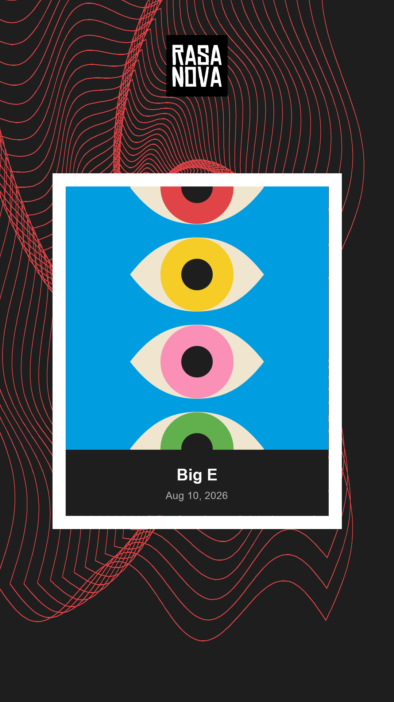
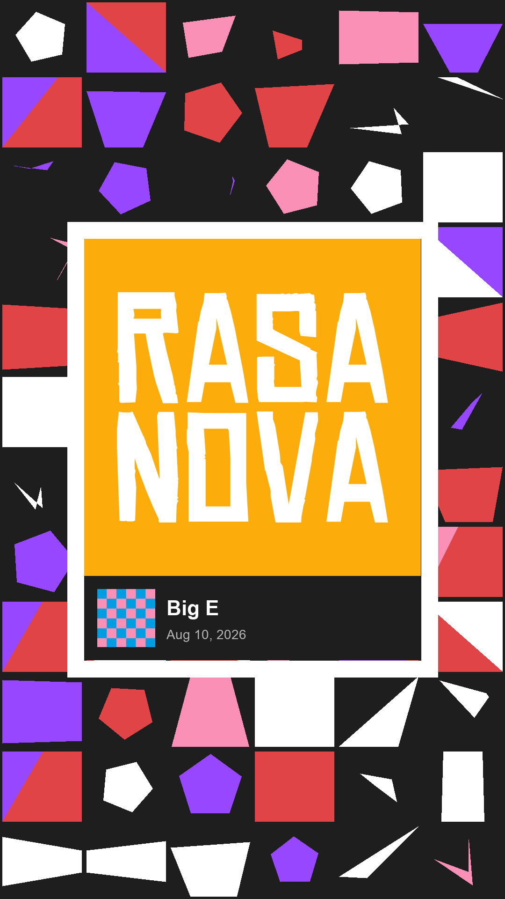
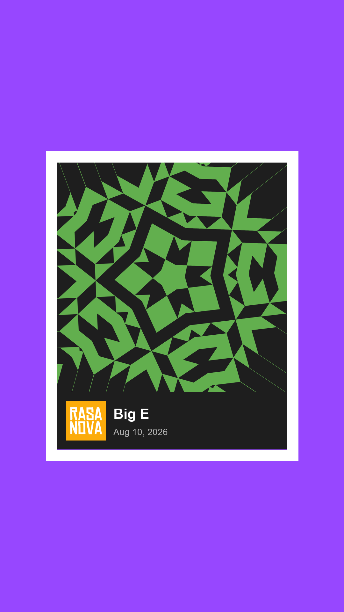
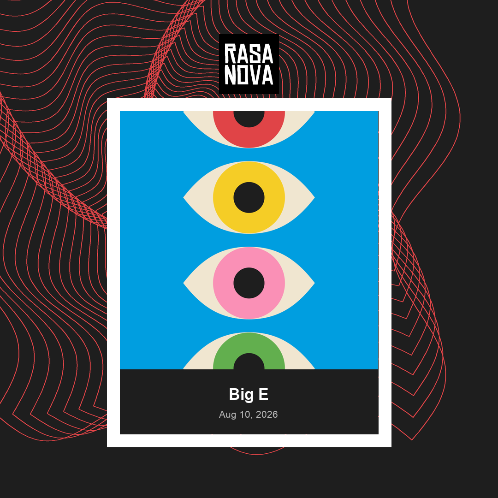
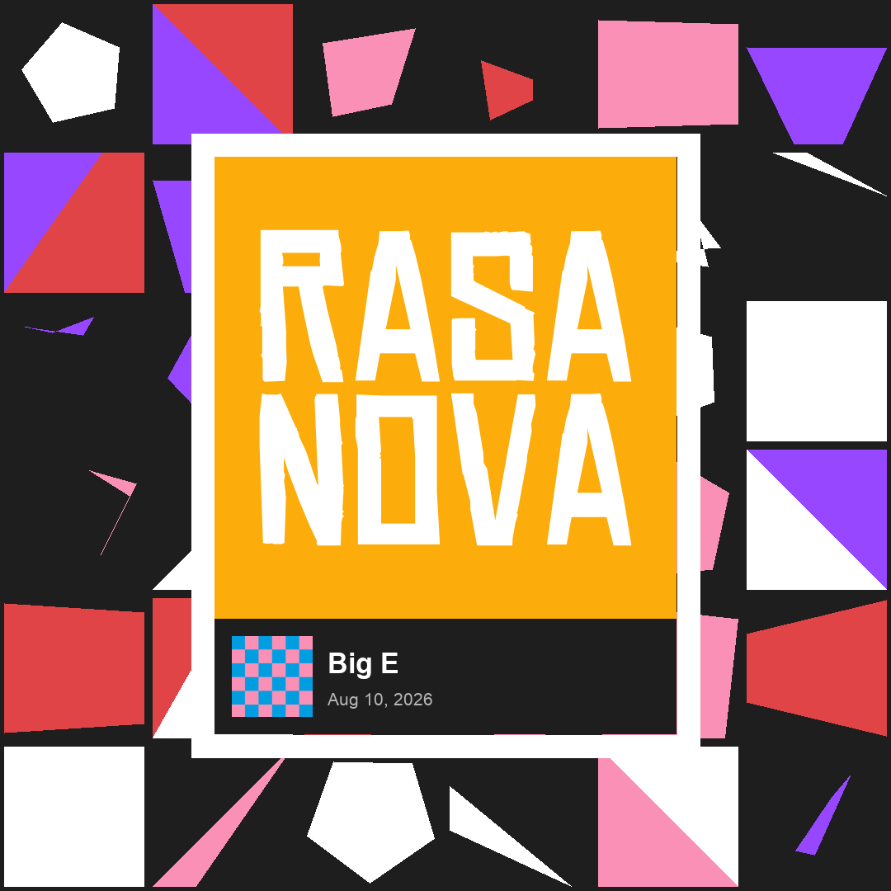
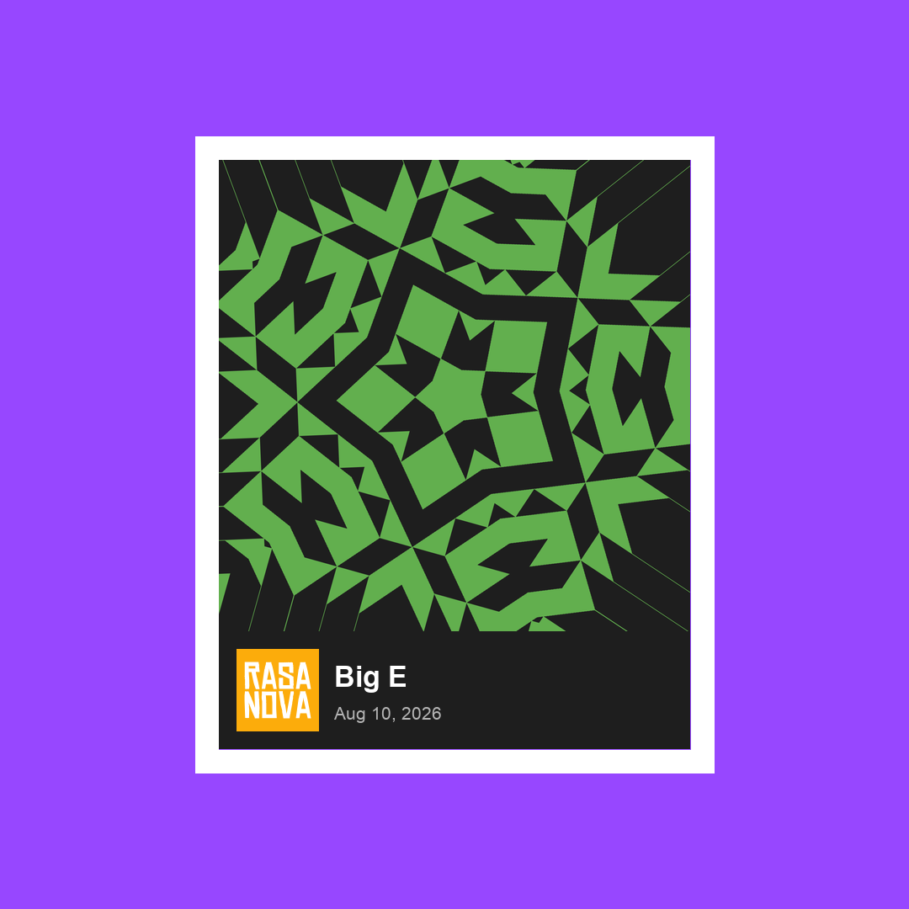
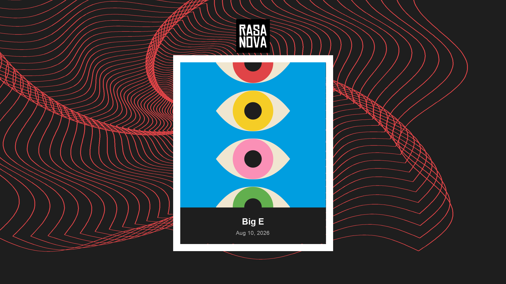
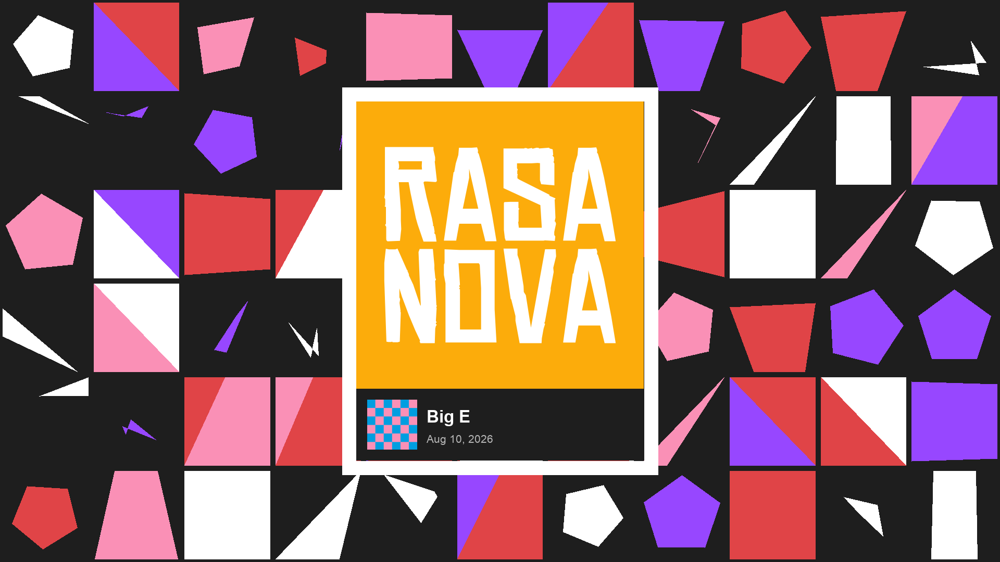
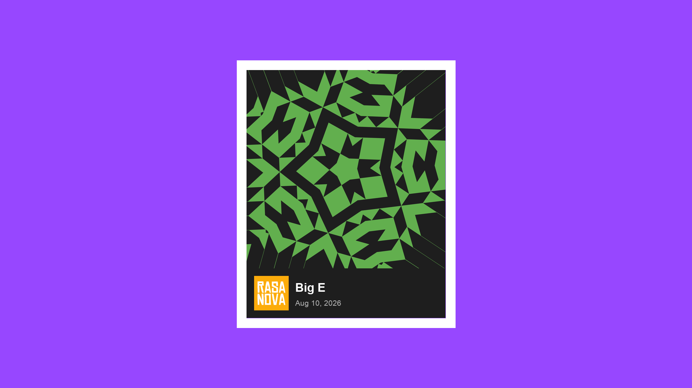

# video-looper

Unified offline renderer for Rasa Nova music visuals. Generates brand-palette artwork (or samples optional video), animates it to audio, and exports **Style A / B / C** layouts at **9:16**, **1:1**, or **16:9**.

## Previews

Same song (*Big E*) and art seed across the grid. Chrome scales with the canvas. Videos zoom/pulse to the music and hard-cut art variants on volume peaks. Audio fades 1s in/out.

**Style A** — spiral + cover &nbsp;·&nbsp; **Style B** — mosaic + logo &nbsp;·&nbsp; **Style C** — solid + kaleidoscope

### Portrait 9:16 — 1080×1920

| Style A | Style B | Style C |
|:---:|:---:|:---:|
|  |  |  |

### Square 1:1 — 1080×1080

| Style A | Style B | Style C |
|:---:|:---:|:---:|
|  |  |  |

### Landscape 16:9 — 1920×1080

| Style A | Style B | Style C |
|:---:|:---:|:---:|
|  |  |  |

## Setup

```bash
cd video-looper
python3 -m venv .venv
.venv/bin/pip install -r requirements.txt
brew install cairo   # required by cairosvg (logo + covers)
```

Needs **FFmpeg** on your PATH (MoviePy uses it).

## Local GUI

One Streamlit app for the Instagram/video queue. Local browser only — not Streamlit Cloud.

```bash
.venv/bin/pip install -r requirements.txt
.venv/bin/streamlit run app.py
```

- **Queue table** and preview stills in the main pane (status: `queued` / `previewed` / `done` / `failed`)
- **Sidebar** (top to bottom): Data source → Song details → Visual settings and preview → Timing → Final actions
- **Scan Google Drive** lists session folders (`1n3PMQwCVkMNiBo6FagsmjImJPNUovuhc`), keeps the newest take per title, and **appends** songs that are not already in the queue (existing order is unchanged)
- **Choose Song** in the sidebar drives display name, date, style A/B/C, aspect, art seed, start, and duration for that row
- **Timing** start + duration lock the sidebar audio player to that clip window (start `0` plays from the beginning of the file; render still uses a seeded random window when start is 0)
- **Render Preview Stills** writes Style stills via `write_layout_previews` and sets status to `previewed` — it does **not** mark done
- **Render Video** uses the same settings through `render()` / `RenderOptions`. Use **Mark Done** when you want `done`
- Audio is downloaded on demand into `audio/<session folder>/` so chrome dates parse from the parent folder (`session_date.py`)

Set `PUBLIC_GOOGLE_API_KEY` in a local `.env` (gitignored). Drive requests send Referer `https://rasanova-band.web.app/` because the site key is referrer-restricted. **Never commit a key.**

Live queue is **`queue.json`** (gitignored). Copy [`queue.example.json`](queue.example.json) or let the GUI create it on first save. A leftover `instagram-queue.json` is read once if `queue.json` is missing, then rewritten to `queue.json`.

## Input

- **Audio (required):** drop songs in `audio/` (`.mp3`, `.wav`, `.aac`, `.m4a`). Session subfolders (Drive-style names like `audio/First Time KC May 16 2026/`) set the on-screen chrome date.
- **Video (optional):** drop clips in `video/` or pass `--video path` — used as Style A/B backgrounds and Style C kaleidoscope source
- Media files are gitignored — keep them local only

Default art path generates stills per song. With `--video`, frames are sampled across the same audio window (`--start` / `--duration` / `--clip-seed`).

## Quick start

**Interactive (song + layout + aspect + optional video):**

```bash
.venv/bin/python3 loop_video.py
```

Daily queue work is faster in the [local GUI](#local-gui) (`streamlit run app.py`).

**One song, one style:**

```bash
.venv/bin/python3 scripts/render_song.py "04 - Whale Song.wav" a
.venv/bin/python3 scripts/render_song.py "04 - Whale Song.wav" b --aspect square
.venv/bin/python3 scripts/render_song.py "04 - Whale Song.wav" c --aspect landscape
```

**Aspect ratios:**

```bash
--aspect portrait    # 9:16 → 1080×1920 (default Shorts)
--aspect square      # 1:1  → 1080×1080
--aspect landscape   # 16:9 → 1920×1080
# aliases: 9:16 | 1:1 | 16:9
```

**Optional video source** (bg / kaleidoscope):

```bash
.venv/bin/python3 scripts/render_song.py "04 - Whale Song.wav" c --video clip.mp4
.venv/bin/python3 scripts/render_song.py "04 - Whale Song.wav" a --video video/loop.mov --aspect square
```

**Clip control** (optional; defaults keep the seeded random 60s window):

```bash
.venv/bin/python3 scripts/render_song.py "04 - Whale Song.wav" a --start 92.5
.venv/bin/python3 scripts/render_song.py "04 - Whale Song.wav" a --clip-seed 7
.venv/bin/python3 scripts/render_song.py "04 - Whale Song.wav" b --start 30 --duration 45
```

**Art lock** (optional; match a picked preview still):

```bash
.venv/bin/python3 scripts/render_song.py "Big E.mp3" a --aspect square --seed 20260814
.venv/bin/python3 scripts/render_song.py "Big E.mp3" a --aspect square --seed 20260814 --start 15 --cover eyes-stack.svg --still 3
```

`--seed` overrides the song-filename art seed. `--cover` locks the SVG template. `--still N` locks Style A to that 1-based preview variant (spiral + matching cover recolor).

**On-screen date** (under the song title — not the MP4 filename stamp):

```bash
.venv/bin/python3 scripts/render_song.py "audio/First Time KC May 16 2026/song.mp3" a
.venv/bin/python3 scripts/render_song.py "song.mp3" a --date "May 16, 2026"
```

Chrome uses, in order: `--date`, the audio file's parent folder name (Drive session folders like `First Time KC May 16 2026`), the filename itself, then the file's birthtime/mtime. It does **not** use the render date when a file exists. Output filenames still use render-time `%Y%m%d_%H%M%S`.

**Static preview PNGs:**

```bash
.venv/bin/python3 scripts/make_previews.py "04 - Whale Song.wav"
.venv/bin/python3 scripts/make_previews.py "04 - Whale Song.wav" --aspect square
.venv/bin/python3 scripts/make_previews.py "Big E.mp3" --style a --seed 20260814 --aspect square
.venv/bin/python3 scripts/make_previews.py "04 - Whale Song.wav" --aspect landscape --video clip.mp4
```

`--style a|b|c` (comma-separated) writes a subset. `--seed` rolls new artwork.

**Batch every file in `audio/`:**

```bash
.venv/bin/python3 video_bus.py a
.venv/bin/python3 video_bus.py c square
```

## Example scripts

| Script | What it does |
|--------|----------------|
| [`app.py`](app.py) | Local Streamlit GUI: Drive scan, queue, preview stills, MP4 render |
| [`scripts/render_song.py`](scripts/render_song.py) | Render one MP4: `song` + `a\|b\|c` + `--aspect` / `--video` / clip / `--seed` / `--cover` / `--still` / `--date` |
| [`scripts/render_both.sh`](scripts/render_both.sh) | Render Style A, B, then C for one song (extra flags forwarded) |
| [`scripts/make_previews.py`](scripts/make_previews.py) | Write static review PNGs; `--style` / `--seed` / `--aspect` / `--video` |
| [`loop_video.py`](loop_video.py) | Interactive song + layout + aspect + video picker |
| [`video_bus.py`](video_bus.py) | Batch-render all songs in `audio/` |

### Library-style call

```python
from render import RenderOptions, render
from art.stills import seed_from_song

song_path = "audio/04 - Whale Song.wav"
song_name = "04 - Whale Song"
seed = seed_from_song(song_name)

render(
    song_path,
    song_name,
    RenderOptions(
        master_seed=20260814,          # or seed_from_song(song_name)
        layout_style="a",
        aspect="square",
        video_path="video/loop.mp4",  # optional
        audio_start=15,
        audio_duration=60,
        cover_filename="eyes-stack.svg",
        still_index=3,                 # Style A: lock preview variant
        display_name="Gumbia",          # optional chrome title; default from filename
        song_date="May 16, 2026",      # optional chrome date; default from folder/filename
    ),
)
```

## Layout styles

| Style | Background | Chrome |
|-------|------------|--------|
| **A** | Generated spiral (or video frames); rotates + zooms with RMS; 3 variants hard-cut on peaks | Centered logo + Now Playing card (cover over title/date); thick white pulsing border |
| **B** | Generated mosaic (or video frames); zooms with RMS; 3 variants hard-cut on peaks | Now Playing card: large logo on accent + cover/meta row; thick white pulsing border |
| **C** | Solid randomized accent; pulses with RMS | Kaleidoscope card art from **generated stills or video frames** (polar N-fold sampler) + logo/meta; peak cuts |

Chrome geometry scales to the chosen aspect (card width, meta bar, fonts, logo).

Covers are recolored from `assets/covers/base/*.svg`. Full MP4s lock **one cover per song** unless `--cover` is set. Preview batches force **three distinct templates** on Style A/B. **Tan `#F0E6D0` is eye sclera only**.

## Brand palette

| Name | Hex | Notes |
|------|-----|--------|
| Red | `#E04447` | |
| Orange | `#FCAC0B` | |
| Yellow | `#F5CD26` | |
| Green | `#62AF4E` | |
| Blue | `#009EE0` | |
| Purple | `#9747FF` | |
| Pink | `#FA90B6` | |
| Slate | `#1E1E1E` | Background candidate |
| White | `#FFFFFF` | Background / fill / border |
| Tan | `#F0E6D0` | **Eye sclera only** |

## Generators / effects

| Name | Description |
|------|-------------|
| `spiral` | Wavy nested-square spiral (Style A backgrounds) |
| `mosaic` | Geometric mosaic cell grid (Style B backgrounds) |
| `kaleidoscope` | Procedural 4-fold triangle grid (Style C source when no video) |
| `kaleido_sampler` | Polar N-fold sampler over generated images **or** video frames |
| `kalenova` / `rasanova` / `mosaova` | Vendored; not wired into the active render path yet |

## Project structure

```
video-looper/
├── assets/
│   ├── rasanova-logo.svg
│   └── covers/base/
├── docs/previews/
├── scripts/
│   ├── render_song.py
│   ├── render_both.sh
│   └── make_previews.py
├── audio/                 # Input songs (gitignored)
├── video/                 # Optional video sources (gitignored)
├── art/
│   ├── generators/
│   └── kaleido_sampler.py
├── app.py                 # Local Streamlit GUI (queue + Drive scan)
├── song_queue.py          # queue.json load/save / unique-title merge
├── drive.py               # Drive session scan + on-demand download
├── chrome.py
├── session_date.py        # On-screen chrome date from session folder / filename
├── tests/
│   ├── test_session_date.py
│   └── test_queue.py
├── queue.example.json     # Empty queue template
├── visualizers.py
├── layout.py              # Aspect → canvas helpers
├── video_source.py        # Frame sampling
├── render.py
├── loop_video.py
└── video_bus.py
```

## Output

```
output/<Song>_9x16_STYLE_A_YYYYMMDD_HHMMSS.mp4
output/<Song>_1x1_STYLE_C_YYYYMMDD_HHMMSS.mp4
output/<Song>_16x9_STYLE_B_YYYYMMDD_HHMMSS.mp4
output/preview/<Song>_9x16_STYLE_A_bg1_….png
```

- Aspects: `1080×1920` / `1080×1080` / `1920×1080`
- Duration: up to 60s by default; override with `--start` / `--duration`
- Audio: **1s fade-in** and **1s fade-out** on the clipped window
- Same filename → same **master seed** unless `--seed` is set
- Window uses the art seed unless `--clip-seed` or `--start` is set
- `--cover` / `--still` lock the cover template and Style A variant to match a preview PNG
